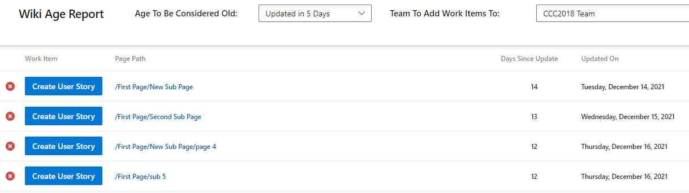

# Wiki Age Report

Keeping documentation in your Azure DevOps Wiki is a great way to keep it at the fingertips of the people already using Azure DevOps.
However, what happens when that documentation gets written and never updated? It becomes stale, old, and just out-of-date WRONG. This extension aims at giving you a report of the age of your wiki pages.
This will allow you to then keep an eye on the potentially stale documentation, and hopefully give everybody a better documented experience!

The rows that have been identified as "old" also will allow the user to create a User Story/Product Backlog Item/Requirement (based on the process template your project is running) so that you can schedule work to review and update the outdated documents.

Enjoy!

## Images
Find the report next to the link to your Wiki

## Credits
[Jeff Przylucki](http://www.oneluckidev.com)
